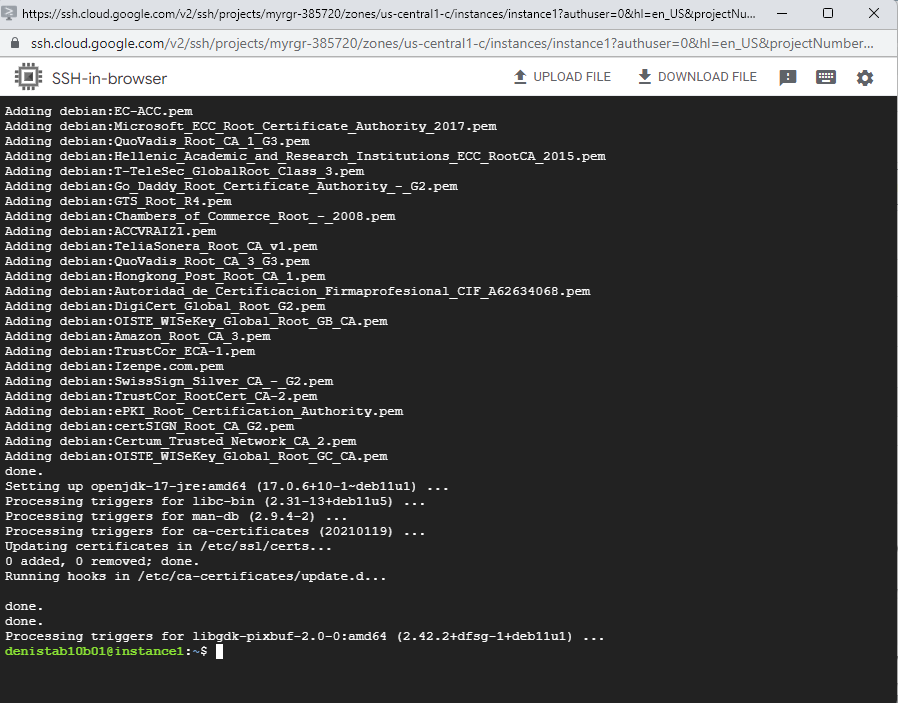
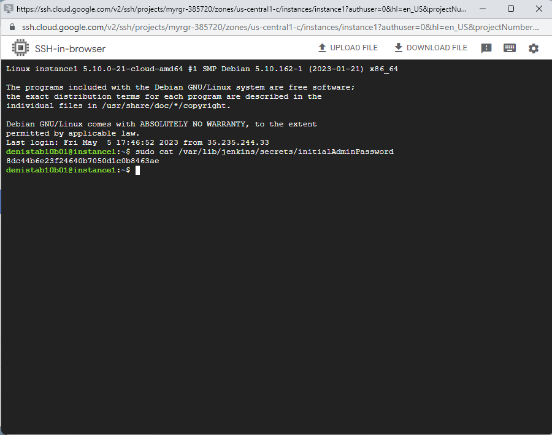

# Розрахункова робота 

Мета роботи:

Максимально автоматизувати створення віртуальної машини за допомогою Terraform та CI/CD. В межах цієї роботи для прикладу було обрано створення та хостинг вебсайту.

#Выполнение работы

Сначало создадим новый проект с названием MyRGR, но подробно мы описывать этот процесс не будем так как мы уже делали это в третьей лабораторной работе.


Создали новый сервис аккаунт с новым ключом формата JSON


а также выдали роль Basic / Editor

 

На данном этапе мы настроили наш сервис аккаунт, теперь перейдем к настройке Terraform

Создадим новый .tf файл как в прошлой лабораторной работе 

main.tf
```
terraform {
required_providers {
google = {
source = "hashicorp/google"
version = "4.51.0"
}
}
}
provider "google" {
credentials = file(var.credentials_file)
project = var.project
region = var.region
zone = var.zone
}

resource "google_compute_network" "vpc_network" {
  name = "myrgr-network"
}


resource "google_compute_instance" "vm_instance" {
name = "instance1"
machine_type = "e2-micro"
tags = ["edu", "micro", "linux", "devops", "ukraine"]

boot_disk {
initialize_params {
image = "debian-cloud/debian-11"
}
}

network_interface {
network = google_compute_network.vpc_network.name
access_config {
}
}
}
resource "google_compute_firewall" "firewall_rules" {
  project       = var.project
  name          = "test-firewall-rule"
  network       = google_compute_network.vpc_network.name
  description   = "Enables all instances in the vpc_network to be able to be connected to from external devices"
  source_ranges = ["0.0.0.0/0"]

  allow {
    protocol = "tcp"
    ports = ["22", "8080"]
  }
 
}
```
Также новшеством является то, что мы добавили правило для брандмауера, відкриття портів та відкриття http і https доступу.
Теперь запишим данные в variables.tf
```
variable "project" {
    default = "myrgr-385720"
 }

variable "credentials_file" {
    default = "myrgr-385720-aeba3033b302.json"
 }

variable "region" {
  default = "us-central1"
}

variable "zone" {
  default = "us-central1-c"
}

variable "subnet-region" {
  default = "us-central1"
}
```
Заходим в терминал, выбираем папку в котором лежит наши .tf файлы и пишем 
```
terraform init
```
потом пишем 
```
terraform apply
```
пишем YES и ждем пока программа закончить работу


Після успішного створення віртуальної машини, повернемося в GCP і перевіримо наявність нашої машини


Теперь нам нужно установить Jenkins. Для начало напишем, что такое Jenkins. 
Jenkins — это инструмент автоматизации с открытым исходным кодом, где происходит координационный процесс и постоянный процесс координации

Перейдем в нашу создаюную машину через SSH. Для этого заходим в GCP/VM instances, видим нашу созданую машину и нажимаем SSH


После того как мы открыли нашу ВМ вводим следующию команду 
```
sudo apt update
```


Для начало разберем, что означает эта команда 

команда sudo - позволяет строго определенным пользователям выполнять указанные программы с административными привилегиями без ввода пароля суперпользователя root.

apt(Advanced Packaging Tool) - набор утилит для управления программными пакетами в операционных системах основанных на Debian

По сути мы этой командой обновляем базу даних менеджеру пакетів apt.

Встановлюємо git с помощью следующий команды
```
sudo apt install git
```
После загрузки выгвстановлюємо Java для подальшої роботи з Jenkins.
```
sudo apt install openjdk-17-jre
```


Дальше слідуємо за інструкцією по встановленню Jenkins.
```
curl -fsSL https://pkg.jenkins.io/debian/jenkins.io-2023.key | sudo tee \
  /usr/share/keyrings/jenkins-keyring.asc > /dev/null

echo deb [signed-by=/usr/share/keyrings/jenkins-keyring.asc] \
  https://pkg.jenkins.io/debian binary/ | sudo tee \
  /etc/apt/sources.list.d/jenkins.list > /dev/null

sudo apt-get update

sudo apt-get install jenkins
```
Ждем когда закончится загрузка


Закрываем нашу машину и перезагружаем ее. С этого момента мы готовы работать с Jenkins. 

Далі в консолі пишемо
```
sudo cat /var/lib/jenkins/secrets/initialAdminPassword
```


Копіюємо цей пароль. Він знадобиться для першої активації Jenkins. Перейдемо за External IP адресою і портом 8080. Відкриється вікно першого налаштування Jenkins. Вводимо отриманий раніше пароль. Встановлюємо рекомендуємі плагіни.


Проводимо швидке налаштування


Зараз нам необхідно створити git репозиторій, з якого Jenkins буде брати код для розгортання. Нашою задачою є створення вебсайту, тому встановимо Apache2 web server.
```
sudo apt-get install apache2
```
После установки мы можем проверить наш сайт, перейдем по external ip http://34.28.161.185/ и увидим Apache2 Default Page


Для того, щоб Jenkins міг виконувати дії від імені root, треба зробити наступне в самій ВМ:
```
cd /etc
sudo nano sudoers
```
Находим строку 
```
# User privilege specification
root    ALL=(ALL:ALL) ALL
```
и добавляем рядок
```
jenkins ALL=NOPASSWD: ALL
```


Це дозволить виконувати команди типу 'sh "sudo..."'

Створимо репозиторій git з назвою RGRweb та загрузимо туди наш pipeline script, але спокатку нам потрібно його створити.

Заходимо у jenkins создаем новый item


Даем имя новому итаму и выбираем Pipeline

Дальше пишим сам Pipeline
```
pipeline {
    agent any
    options {
        disableConcurrentBuilds()
    }
    stages {
        stage('Checkout') {
            steps {
                checkout scmGit(
                    branches: [[name: 'main']],
                    userRemoteConfigs: [[url: 'https://github.com/DenysShynkarenko/RGRweb.git']])
            }
        }
        stage('Build') {
            steps {
                sh 'sudo cp /var/lib/jenkins/workspace/JEK/* /var/www/html/'
            }
        }
    }
}
```

Сохраняем и собираем наш паплайн
Після очікування ми отримали успішну зборку


Після очікування ми отримали успішну зборку


Ми успішно застосували наші знання, набуті під час курсу, для розробки цієї РГР. Зокрема, ми використали Terraform для автоматизації розгортання ВМ та продемонстрували наші навички в роботі з цією технологією. Ми також використовували наші знання з Jenkins для автоматизації CI/CD процесу. Крім того, ми застосували наші знання про GCP для написання конфігураційних файлів для Terraform, а також використали Git як незамінний інструмент для нашого проекту.

У наслідок нашої роботи, ми створили гнучкий та ефективний пайплайн, що мінімізує ручну роботу. Єдині ручні дії полягали у підготовці ВМ для запуску Jenkins та генерації ключів для Terraform. Після цих дій, ми могли змінювати весь проект за допомогою кількох рядків конфігураційних файлів, якщо мова йшла про ВМ, або просто виконавши push, якщо ми змінювали сервер напряму.


 


